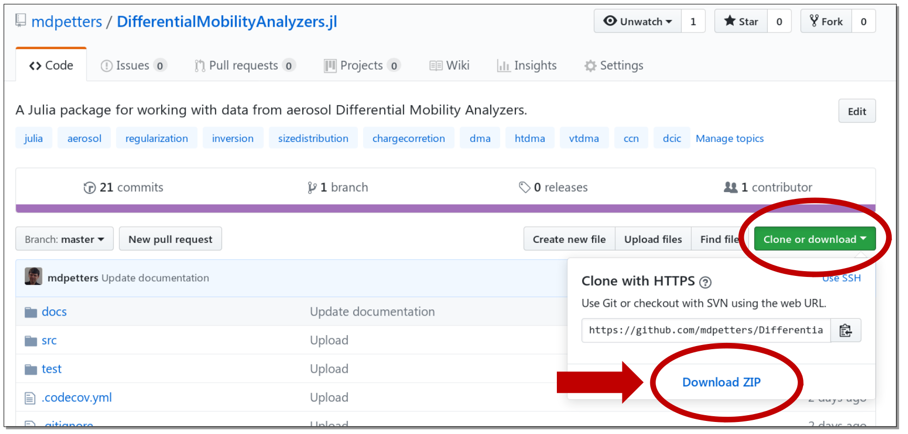
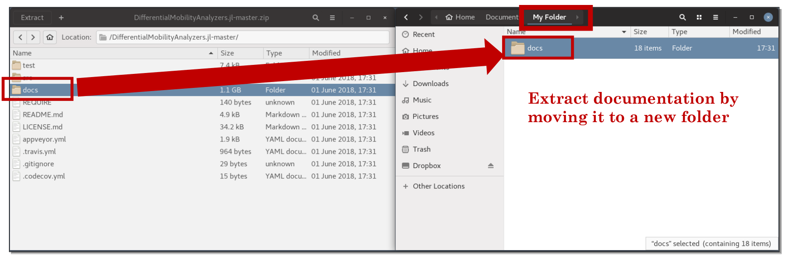
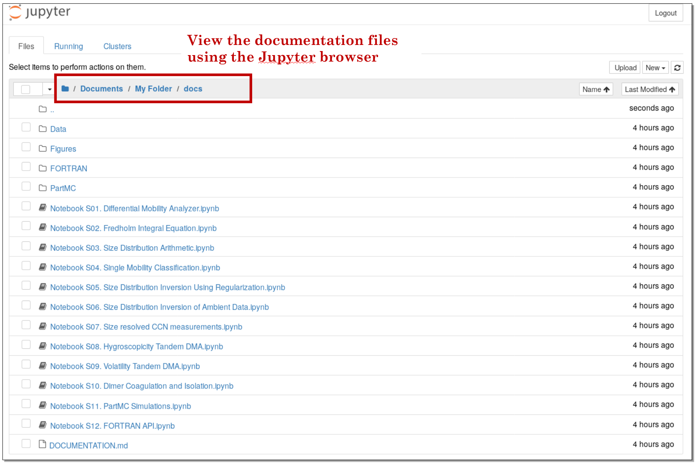
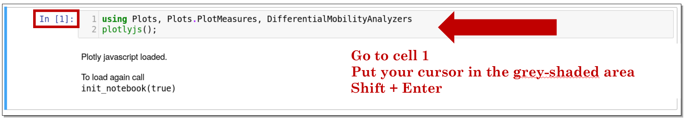

## Documentation

### Overview
The main documentation of the package is described in a manuscript submitted  for Open Access publication to the journal [Aerosol Science & Technology](https://www.tandfonline.com/action/journalInformation?journalCode=uast20). In addition, a series of [Jupyter](http://jupyter.org/) notebooks provides example usage and additional detailed documentation. The Jupyter notebooks also serve as formal supplement to the manuscript. This remainder of this document is structured as follows.

1. Why Julia?
2. Managing Expectations (for Newcomers to Julia)
3. Installation & Getting Started
4. Package Documentation

### 1. Why Julia?
This software started as a MATLAB script to model the DMA response function of a specific [instrument](https://www.tandfonline.com/doi/abs/10.1080/02786826.2016.1221050) developed and used in my laboratory. Over time the project morphed from a script performing a single task to a more formal language that could be used to express differential mobility analyzer response functions in a more general manner. Implementation of this language required formalisms that MATLAB did not support, including recursion over lambda expressions, support of the constructs map and mapreduce, full Unicode support within the actual code, and the ability to create and share code and visualizations that non-expert programmers can interact with in a meaningful way. I also wanted the entire software suite to be free software.

[Julia](https://julialang.org/) is a relatively young programming language that promises to bridge general and scientific computing. The language bears some resemblance to MATLAB syntax. In many ways Julia code is intuitive and ideally suited for scientific programming. Julia is a dynamically-typed programming language that can rival C or FORTRAN execution speeds. It supports all of the above mentioned requirements. In addition, Julia has an excellent package managing system that allows straightforward installation of the new packages and their dependencies.

### 2. Managing Expectations (for Newcomers to Julia)
Although Julia is promising, the above advantages come at some cost.

#### (a) Just in Time Compiler
Julia uses a [Just in Time (JIT) compiler](https://en.wikipedia.org/wiki/Just-in-time_compilation). When Julia first starts and packages are loaded, there can be significant JIT lag. For example, this results in slow (to very slow) time to first plot. The reason for this is that the entire [Plots.jl](http://docs.juliaplots.org/latest/) package is compiled each time the interpreter starts and the Plots.jl package is first invoked. On the flip side, once a package is loaded, execution is generally almost as fast as achievable with the hardware. Because of this issue, the execution speed is slow the first time the cells in the Jupyter notebooks are called. Once the notebook has executed once, cells can be modified to interact with the code and fast results are obtained. When working with the [Julia IDE](http://junolab.org/), the Julia interpreter is usually loaded once and the issue is mitigated.

#### (b) Ease of Use
Although Julia is dynamically-typed and in syntax apparently similar to MATLAB, the language is more abstract. For example, to optimize code types are specified explicitly. The [formal type system](https://docs.julialang.org/en/stable/manual/types/) may require a more in-depth engagement by the user with programming fundamentals relative to other common scientific programming languages such as IDL/GDL or MATLAB/GNU Octave.

#### (c) Continuing Julia Development
The original package was developed at a time when the Julia language was undergoing rapid development and not yet stable. The original version of the Package was written in Julia 0.6 and will neither run on older nor newer versions. 

The current version of the package is compatible with Julia 1.1 and it is recommended to use the current version of the package and Julia.

#### (d) Getting Help
Julia and Julia packages are well-documented from a programmers perspective. However, the focus on being a more general programming language, the distributed nature of the packages and the relatively early stage of development may at times require some tenacity by the user. An excellent resource is the [Julia tutorial compilation](https://julialang.org/learning/). <br>

### 3. Installation & Getting Started
To interactively use the Notebooks and/or use the software follow the steps below. __If you just want to view the Notebooks or use the virtual machine go to Section 4.__

#### (a) Julia
This software will only work with Julia v0.6.x. The Julia binaries for Window, MacOS, or Linux can be downloaded [here](https://julialang.org/downloads/).

#### (b) DifferentialMobilityAnalyzers.jl
The package  <b> DifferentialMobiliyAnalyzers </b> can be installed from the Julia package prompt with
```julia
pkg> add https://github.com/mdpetters/DifferentialMobilityAnalyzers.jl.git
pkg> add Calculus DataFrames Distributions Glob IJulia Interpolations LambertW LinearAlgebra LsqFit NetCDF ORCA PlotlyJS Plots Printf ProgressMeter Random SpecialFunctions StatsBase

```
This installs the package and any missing dependencies. (Patience required for fresh install due to large number of dependencies, including the Jupyter environment).

#### (c) Notebooks
At the Julia REPL prompt invoke the Jupyter Notebook server
```julia
julia> using IJulia
julia> notebook(detached=true)
```
This opens the Jupyter tree view in your default web browser. Jupyter Resources: <br>

[Project Jupyter](http://jupyter.org/)<br>
[Jupyter Notebook Documentation](https://jupyter-notebook.readthedocs.io/en/stable/)<br>
[Jupyter Shortcuts](https://www.cheatography.com/weidadeyue/cheat-sheets/jupyter-notebook/)<br>

#### (d) Load Notebooks
Download the ZIP archive of DifferentialMobilityAnalyzers.jl


---

Extract the docs/ folder from the ZIP archive to a folder of your choice
  

---

Use the Jupyter file browser to navigate to the folder


---

Open a Notebook. In the top right corner it shows the Julia version. On the first load the button to the left will state "Not Trusted". Click on the button to change to Trusted as shown. This enables the Javascript content.


---

Click on the first cell that contains code and hit Shift-Enter to execute the cell. The pending cell execution and processing is indicated by the changing of the cell number (number in brackets) to an asterisk. As indicated earlier, he first time a cell is executed it can be slow. Move on to next cell and repeat. A cell block can be executed twice in a row with altered numbers (e.g. change the axis limits). All cells can be executed in series using Kernel -> Restart & Run All.
 <br>

### 4. Package Documentation
The Julia DMA language is documented in a journal manuscript and 12 Supplementary Jupyter Notebooks. The links open the notebooks in viewer mode via NBViewer.

The Julia DMA Language: [Manuscript](Manuscript.pdf) and [Supporting Information](SI.pdf) <br>

[Notebook S1. Differential Mobility Analyzer](https://nbviewer.jupyter.org/github/mdpetters/DifferentialMobilityAnalyzers.jl/blob/master/docs/Notebook%20S01.%20Differential%20Mobility%20Analyzer.ipynb) <br>
This notebook introduces the Differential Mobility Analyzer (DMA) and demonstrates basic functions embedded in the package <b> DifferentialMobilityAnalyzers.jl </b>. The notebook includes Figures of the schematic of the DMA, the size dependence of the Cunningham slip flow correction factor, particle diffusion coefficient, penetration efficiency through the DMA, and the fractional charging efficiency of the bipolar charger. It also includes examples of the normalized DMA transfer functions.

[Notebook S2. Fredholm Integral Equation](https://nbviewer.jupyter.org/github/mdpetters/DifferentialMobilityAnalyzers.jl/blob/master/docs/Notebook%20S02.%20Fredholm%20Integral%20Equation.ipynb) <br>
This notebook introduces the Fredholm integral equation and derives the discretized solution via the forward convolution matrix. The notebook demonstrates how the convolution matrix is computed for any set of transmission functions.

[Notebook S3. Size Distribution Arithmetic](https://nbviewer.jupyter.org/github/mdpetters/DifferentialMobilityAnalyzers.jl/blob/master/docs/Notebook%20S03.%20Size%20Distribution%20Arithmetic.ipynb) <br>
This notebook introduces the SizeDistribution type. Seven unique operations are defined and showcased: (a) Multiplication of scalar and size distribution,
(b) Multiplication of vector and size distribution, (c) Multiplication of matrix and size distribution, (d) Multiplication of size distribution and size distribution, (e) Division of size distribution and size distribution (f) Dot product of scalar and size distribution, (g) Dot product of vector and size distribution, and (h) Addition of two size distributions.  

[Notebook S4. Single Mobility Classification](https://nbviewer.jupyter.org/github/mdpetters/DifferentialMobilityAnalyzers.jl/blob/master/docs/Notebook%20S04.%20Single%20Mobility%20Classification.ipynb) <br>
This notebook demonstrates how the software can be used to find the true size distribution of monodisperse mobility selected particles. It also demonstrates how to compute the selected number, surface area, and volume concentration.

[Notebook S5. Size Distribution Inversion Using Regularization](https://nbviewer.jupyter.org/github/mdpetters/DifferentialMobilityAnalyzers.jl/blob/master/docs/Notebook%20S05.%20Size%20Distribution%20Inversion%20Using%20Regularization.ipynb) <br>
This notebook demonstrates how to invert a size distribution from a measured noisy response function. Application of the convolution matrix together with a Twomey inverse and the L-curve algorithm are used to invert a synthetic dataset.

[Notebook S6. Size Distribution Inversion of Ambient Data](https://nbviewer.jupyter.org/github/mdpetters/DifferentialMobilityAnalyzers.jl/blob/master/docs/Notebook%20S06.%20Size%20Distribution%20Inversion%20of%20Ambient%20Data.ipynb) <br>
This notebook applies the regularized inverse to a published dataset. Results are compared to the inversion output of the manufacturer supplied software and evaluates the degree of agreement between this package and the manufacturer software.

[Notebook S7. Size resolved CCN measurements](https://nbviewer.jupyter.org/github/mdpetters/DifferentialMobilityAnalyzers.jl/blob/master/docs/Notebook%20S07.%20Size%20resolved%20CCN%20measurements.ipynb) <br>
This notebook demonstrates calculations related to the the configuration where a single differential mobility analyzer is used together with a condensation particle counter and cloud condensation nuclei counter. It is demonstrated how to express the response function in terms of the language and how to fit the response function to infer the cloud droplet activation diameter.

[Notebook S8. Hygroscopicity Tandem DMA](https://nbviewer.jupyter.org/github/mdpetters/DifferentialMobilityAnalyzers.jl/blob/master/docs/Notebook%20S08.%20Hygroscopicity%20Tandem%20DMA.ipynb) <br>
This notebook demonstrates calculations related to the configuration where the first differential mobility is used as classifier. The output is conditioned in a humidifier and the resulting size distribution is measured using a second DMA in scanning mode together with a condensation particle counter (or other instrument) as detector. It is demonstrated how the language can be used to express the response function of the second differential mobility analyzer used either with or without bipolar charger.

[Notebook S9. Volatility Tandem DMA](https://nbviewer.jupyter.org/github/mdpetters/DifferentialMobilityAnalyzers.jl/blob/master/docs/Notebook%20S09.%20Volatility%20Tandem%20DMA.ipynb) <br>
This notebook demonstrates calculations related to the configuration where the first differential mobility is used as classifier. The output is conditioned in an evaporator or condenser and the resulting size distribution is measured using a second differential mobility analyzer in scanning mode together with a condensation particle counter (or other instrument) as detector. It is demonstrated how the language can be used to express the response function of the second differential mobility analyzer used either with or without bipolar charger.

[Notebook S10. Dimer Coagulation and Isolation](https://nbviewer.jupyter.org/github/mdpetters/DifferentialMobilityAnalyzers.jl/blob/master/docs/Notebook%20S10.%20Dimer%20Coagulation%20and%20Isolation.ipynb) <br>
This notebook demonstrates calculations related to the configuration where two DMAs are used to size select particles of opposite charge. The two populations are merged and allowed to coagulate. Coagulated dimers are isolated using an electrostatic filter. The dimers are charge neutralized and the size distribution is measured using a DMA operated in stepping or scanning mode. It is demonstrated how the language can be used to express the response function of the third differential mobility analyzer.

[Notebook S11. PartMC Simulations](https://nbviewer.jupyter.org/github/mdpetters/DifferentialMobilityAnalyzers.jl/blob/master/docs/Notebook%20S11.%20PartMC%20Simulations.ipynb) <br>
This notebook presents an overview over coagulation theory. It is shown how to predict the coagulated distribution using Size Distribution Arithmetic (Notebook S3). The approach is compared to model predictions with the Particle-resolved Monte Carlo code for atmospheric aerosol simulation [(PartMC)](http://lagrange.mechse.illinois.edu/partmc/)

[Notebook S12. FORTRAN API](https://nbviewer.jupyter.org/github/mdpetters/DifferentialMobilityAnalyzers.jl/blob/master/docs/Notebook%20S12.%20FORTRAN%20API.ipynb) <br>
This notebook demonstrates how to construct a convolution matrix using a DMA transfer function defined in a FORTRAN routine. The notebook explains how to compile the routine to a shared library and setup ```ccall``` to pass variables to and from the FORTRAN routine.

[Virtual Machine](https://doi.org/10.5281/zenodo.1432522)<br>
Download virtual machine containing a working version of the software (for Julia 0.6.4). Further instructions are found in the [Supporting Information](Supporting%Information.pdf)<br>
