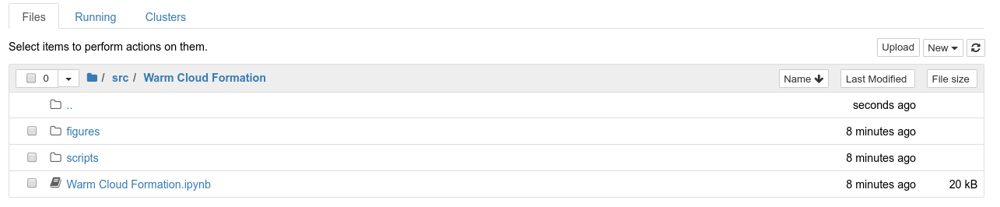

# Atmospheric Physics
Author: [Markus Petters](https://meas.sciences.ncsu.edu/people/mdpetter/)

This repository contains Jupyter notebooks used to supplement instruction in MEA-412: Atmospheric Physics [(Course Catalog)](http://catalog.ncsu.edu/undergraduate/coursedescriptions/mea/) taught in the [Department of Marine, Earth, and Atmospheric Sciences](https://meas.sciences.ncsu.edu/) at [NC State University](https://www.ncsu.edu/). 


The notebooks can be executed in the browser through binder. Binder serves a 
complete Jupyter/julia environment in your browser. Click on the badge below to
launch it.

[](https://mybinder.org/v2/gh/mdpetters/Atmospheric-Physics-Notebooks.git/master)

Use the Jupyter file-manager to navigate to a notebook. For example,
the directory ```src/Warm Cloud Formation``` as shown below.



Start the notebook ```Warm Cloud Formation.ipynb``` and "Run All Below".


During the first execution of the notebook julia compiles some code. 
Time of first execution is ~2 min. Once a cell has been processed a 
number appears in parenthesis, e.g. ```In[1]```


The notebook is now ready. You can interact with the graphs using the 
widgets provided with each element. It is not necessary to execute 
the cells again. However, the notebook is a complete programming environment. 
Second execution of the code is fast. Indivual cells can be executed using 
CTRL-ENTER.

Binder watches for activity. After ~10 min of inactivity, the container is destroyed. 
Once the container is destroyed the computing environment is closed and the buttons become unresponsive. 

The notebooks can also be executed locally as described in Local Installation.  