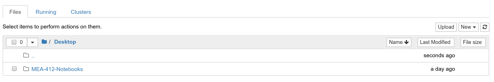
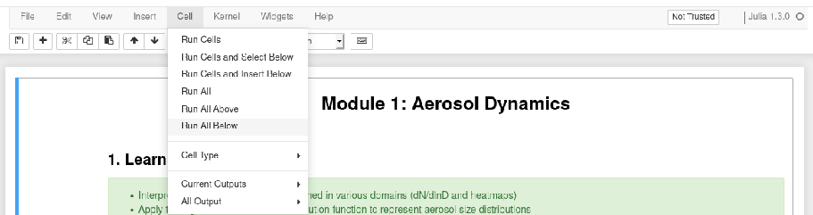
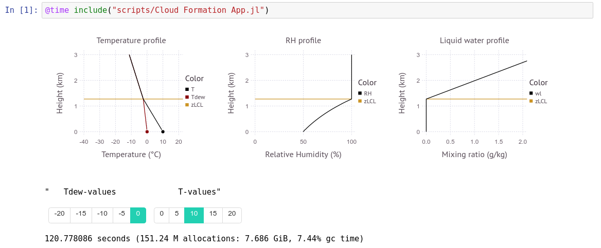
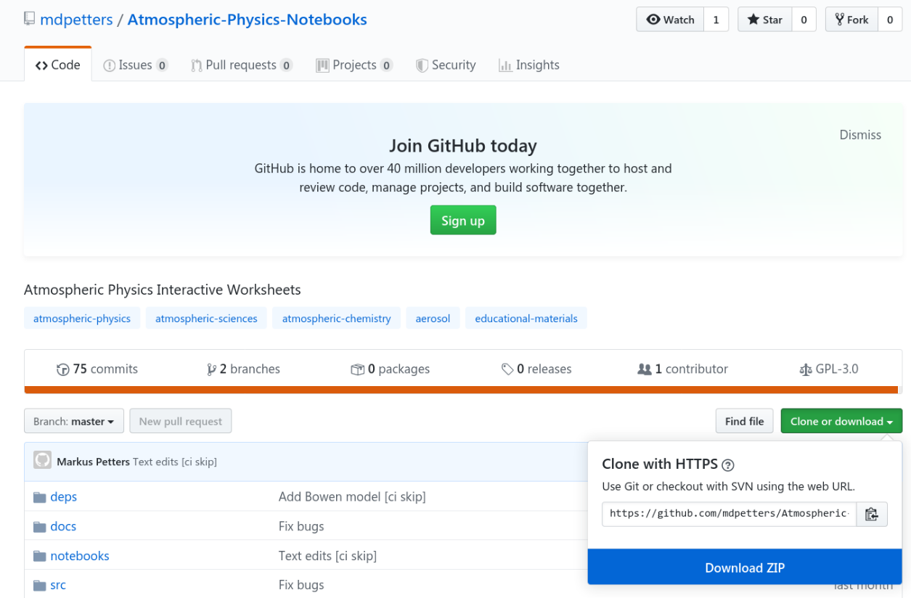

There are several ways to run the notebooks (see more below). Whichever method is selected, the notebooks must be loaded and executed using Jupyter. Use the Jupyter file-manager to navigate to a notebook. For example,
the directory ```/notebooks/Module 1 - Aerosol Dynamics``` as shown below.



Start the notebook ```Module 1 - Aerosol Dynamics.ipynb``` and "Run All Below". Make sure to **wait** until the kernel is initialized before running the cells. 



Once a cell has been processed a number appears in parenthesis, e.g. ```In[1]```



The notebook is now ready. You can interact with the graphs using the widgets provided with each element. It is not necessary to execute the cells again. However, the notebook is a complete programming environment and can be used as such. Indivual cells can be executed using CTRL-ENTER.

## Pre-built Docker
A pre-built docker image is available from DockerHub. The docker container can be executed on local hardware using the docker engine. Docker is available free of charge for Windows, Mac OS, and Linux [Docker Download](https://docs.docker.com/install/). Once downloaded the notebooks can be executed using the command

```
docker run -it -p 8888:8888 mdpetters/atmospheric-physics-notebooks:current
```

|  Advantages |  Disadvantages |
|---|---|
| Requires only docker engine installation | Does not work on mobile devices |
| Can use own hardware | Changes are lost after the session |
| Does not require internet to run | Pre-built image may change without notice 
| Once downloaded you 'own' the softare forever | Requires large download |
| Precompiled for fast execution | |
| Independent of OS | |
| Rquires no julia knowledge | | 

## Self-built Docker
The docker container can be built locally. The repository follows the [reproducible build specifications](https://repo2docker.readthedocs.io/en/latest/specification.html). It is generated using [repo2docker](https://repo2docker.readthedocs.io/en/latest/).

```
repo2docker --user-name=jovyan --no-run --image-name=NAME:TAG https://github.com/mdpetters/Atmospheric-Physics-Notebooks.git
```

|  Advantages |  Disadvantages |
|---|---|
| Can use own hardware | Changes are lost after the session |
| Does not require internet to run | Requires docker engine installation and other dependencies | 
| Can tweak Dockerfile configuration | Takes significant time to compile |
| Once generated you own the image | Does not work on mobile devices |
| Host your own image on Dockerhub or Jupyterhub | |
| Precompiled for fast execution | |
| Independent of OS | |
| Rquires no julia knowledge | |

## Jupyterhub with Kubernetes
The pre-built or self-built docker container can be served to a large group using [jupyter-hub](https://zero-to-jupyterhub.readthedocs.io/en/latest/index.html) with Kubernetes. The Kubernetes cluster requires a cloud-computing provider. Running the Kubernetes engine for students to access the content 24/7 costs ~\$30/user and semester.

|  Advantages |  Disadvantages |
|---|---|
| Requires no installation for students | Requires setup by instructor |
| Scalable for large classes | Cloud resources are expensive |
| Can be used on any device with a browser | Requires (fast) internet connection |
| Cloud service has near 100% realiability | Changes are lost after the session |
| Independent of OS | |
| Rquires no julia knowledge | | 

## Local Installation

The notebooks can also be executed locally as described in local installation. Local installation is needed for development of new content or changes of existing content. 

|  Advantages |  Disadvantages |
|---|---|
| Make persistent changes to content | Requires management of dependencies |
| Runs on local hardware | Probably requires linux, not tested on MacOS or Win |
| Full control over all content | Requires knowledge of the julia language |


Install the latest release of julia from [https://julialang.org/downloads/](https://julialang.org/downloads/). 

Once installed start the julia REPL (Read-Eval-Print-Loop)

```
              _
   _       _ _(_)_     |  Documentation: https://docs.julialang.org
  (_)     | (_) (_)    |
   _ _   _| |_  __ _   |  Type "?" for help, "]?" for Pkg help.
  | | | | | | |/ _` |  |
  | | |_| | | | (_| |  |  Version 1.4.0 (2020-03-21)
 _/ |\__'_|_|_|\__'_|  |  Official https://julialang.org/ release
|__/                   |

julia>
```

At the prompt type 

```
julia> ]
```
to start the package manager. Then, add the following julia packages:

```julia
pkg> add CSV Colors Compose Conda Contour DataFrames DifferentialEquations Distributions Documenter Gadfly IJulia Interact Interpolations LsqFit NumericIO ParameterizedFunctions Pkg PyCall Roots SpecialFunctions WebIO
```

Next, install the Jupyter notebook server
```julia
julia> using IJulia
julia> notebook()
```
Next, exit the notbook and exit out of the julia REPL session. Restart the REPL and install the WebIO Jupyter extension:

```julia
julia> using WebIO
julia> WebIO.install_jupyter_nbextension()
```
Finally, download the ZIP'ed notebooks from GitHub: [Atmospheric-Physics-Notebooks](https://github.com/mdpetters/Atmospheric-Physics-Notebooks)



Extract the ZIP file to location of your choice (e.g. ```Documents```). Next restart ```julia``` and perform the following additional installations. This step only needs to be performed once.

```julia
julia> cd("Path/To/Atmospheric-Physics-Notebooks")
julia> ]
pkg> dev deps/AtmosphericThermodynamics/
```

Finally, start the notebook server:

```julia
julia> using IJulia
julia> notebook()
```

Navigate to the extracted folder and open any of the notebooks, i.e. files with with the ```.ipynb``` extension.

External dependencies (e.g. pyrcel) [pyrcel model](https://pyrcel.readthedocs.io/en/latest/install.html) must be installed manually. See the [Dockerfile](https://github.com/mdpetters/Atmospheric-Physics-Notebooks/blob/master/Dockerfile) and/or external package documentation for how this is achieved. 

During the first execution of the notebook julia compiles some code. Time of first execution is ~2-5 min. The notebook is now ready. The second execution of the cell is fast. However, the load time is long every time a new session is started. This circumvented in the docker container because a compiled julia system image is built using [Fezzik.jl](https://github.com/TsurHerman/Fezzik). See the [Dockerfile](https://github.com/mdpetters/Atmospheric-Physics-Notebooks/blob/master/Dockerfile) for how this is achieved. 

Note that the widget state can become corrupted during execution. It is good policy to run "Restart Kernel & Clear All Output" before closing and ``saving the notebook.